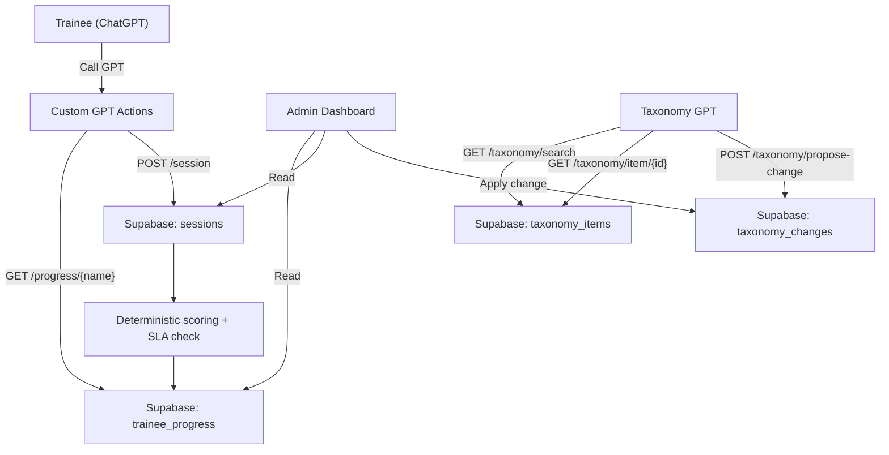

# Connexion Training Hub — Source of Truth & Workflows

Last updated: 2026-03-12

This document is the single, plain‑English reference for how the training system and taxonomy GPT work end‑to‑end. It is written for someone who has never seen the project before.

---

**What this system does**
- Runs training calls through Custom GPTs
- Records every session, score, and feedback per trainee
- Tracks progression levels and stages
- Provides an auditable taxonomy GPT that answers only from the taxonomy source of truth

---

**Key concepts (in one paragraph)**
- Trainees interact with a Custom GPT (the “Call GPT”). At the end of each session, the GPT sends a structured report to the backend. The backend calculates deterministic scores, applies SLA priority logic, stores feedback and results, and updates trainee progress. The Taxonomy GPT is separate: it answers ticket classification questions using the taxonomy stored in Supabase and can propose or apply changes via Actions (with audit logs).

---

**System diagram**

---

**Data model (authoritative store)**

1. **users**
   - One row per trainee/admin
   - Primary identity is `clerk_id`

2. **sessions**
   - One row per completed training call
   - Stores:
     - `feedback_text`
     - deterministic scores (`score_breakdown`, `score_points`)
     - SLA fields (`severity_level`, `impact_level`, `priority_correct_value`)

3. **trainee_progress**
   - One row per user per bot
   - Tracks:
     - stage progression
     - level and points
     - pass/fail totals

4. **taxonomy_items**
   - Source of truth for classification + playbooks

5. **taxonomy_changes**
   - Audit log of proposals, imports, and applied changes

---

# Project 1 — Call GPT (Training)

**Purpose**
- Train technicians on call handling, SLA awareness, and process

**Deterministic scoring**
- GPT sends `rubric_evidence` booleans only
- Server computes 1–10 category scores
- No random scores are accepted

**SLA priority correctness**
- GPT must send `severity_level` + `impact_level`
- Server derives expected priority and marks correct/incorrect

**Levels**
- Level 1: call handling only
- Level 2: simple first‑call resolution (password reset, lockout)
- Unlock rule: `score_points >= 40`

---

## Call GPT workflow

1. **Session start**
   - GPT asks for full name
   - GPT calls `GET /progress/{name}` (Action)

2. **Call simulation**
   - GPT runs call per prompt
   - GPT collects rubric evidence

3. **Session end**
   - GPT calls `POST /session`
   - Backend calculates score + updates progress

4. **Admin views**
   - `/dashboard/admin/sessions` for details
   - `/dashboard/admin/trainees/{id}` for per‑trainee progress

---

# Project 2 — Taxonomy GPT

**Purpose**
- Provide authoritative classification and playbook guidance
- Prevent hallucinations by forcing all answers to come from the DB

**How it works**
1. GPT calls `GET /taxonomy/search` with the user’s question
2. GPT selects best match
3. GPT calls `GET /taxonomy/item/{id}` and answers using those fields only

**Updates**
- GPT may propose changes: `POST /taxonomy/propose-change`
- Admin can apply changes: `POST /taxonomy/apply-change`
- All changes are recorded in `taxonomy_changes`

---

# Admin Portal Workflows

## A) Update taxonomy
1. Open `/dashboard/admin/taxonomy`
2. Upload Excel/CSV (replaces taxonomy)
3. Verify items list updated
4. Changes logged in `taxonomy_changes`

## B) Add source docs for taxonomy GPT
1. Open `/dashboard/admin/taxonomy`
2. Use **Source docs** panel to upload playbooks/escalation docs
3. GPT will receive these via `GET /prompt/{bot_id}`

## C) Review trainee progress
1. Open `/dashboard/admin/trainees`
2. Select trainee
3. Review:
   - Level + points
   - Rubric averages
   - SLA correctness

---

# API reference (Action endpoints)

**Call GPT**
- `GET /progress/{name}`
- `POST /session`
- `POST /upload`

**Taxonomy GPT**
- `GET /taxonomy/search`
- `GET /taxonomy/item/{id}`
- `POST /taxonomy/propose-change`
- `POST /taxonomy/apply-change`

**Admin (internal)**
- `POST /api/admin/taxonomy/import`
- `PATCH /api/admin/taxonomy/{id}`
- `DELETE /api/admin/taxonomy/{id}`

---

# Testing checklist

## Call GPT
- Submit a session and confirm:
  - session row created
  - score_breakdown populated
  - trainee_progress updated

## Taxonomy GPT
- Ask a classification question
- Confirm it returns item id and fields
- Propose change and verify audit entry

---

# Key configuration

Environment variables (minimum):
- `NEXT_PUBLIC_SUPABASE_URL`
- `NEXT_PUBLIC_SUPABASE_ANON_KEY`
- `SUPABASE_SERVICE_ROLE_KEY`
- `CLERK_SECRET_KEY`
- `TAXONOMY_BOT_ID`

---

# Where to find everything

- Admin taxonomy UI: `/dashboard/admin/taxonomy`
- Bot prompt editor: `/dashboard/admin/bots/{bot_id}`
- Session detail: `/dashboard/admin/sessions/{id}`
- Trainee detail: `/dashboard/admin/trainees/{id}`

---

End of document.
